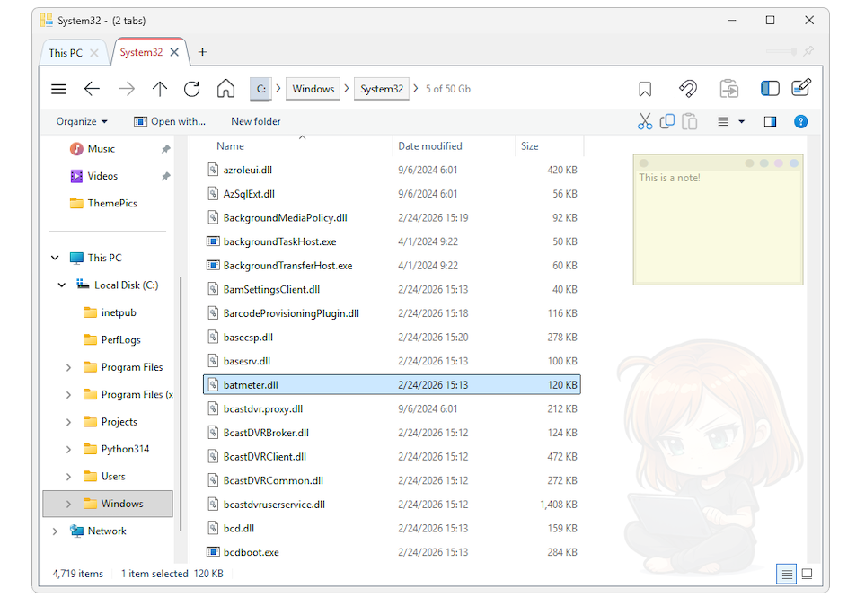
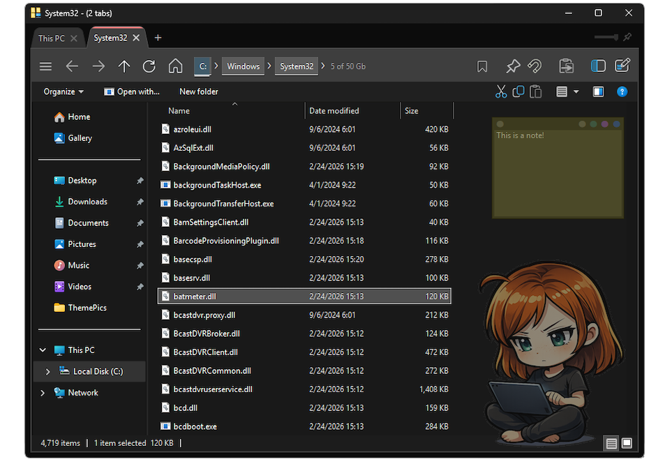

# TabExplorer
A tabbed Windows file explorer replacement that wraps the native explorer core for total compatibilty.

- [Manual in Spanish](docs/TabExplorer.ES%20-%20Castellano.pdf)
- [Manual in English](docs/TabExplorer.EN%20-%20English.pdf)
- [Manual in Catalán](docs/TabExplorer.CAT%20-%20Català.pdf)
