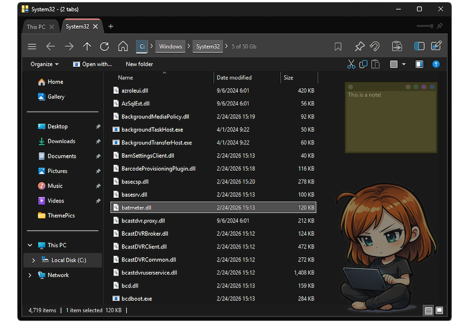
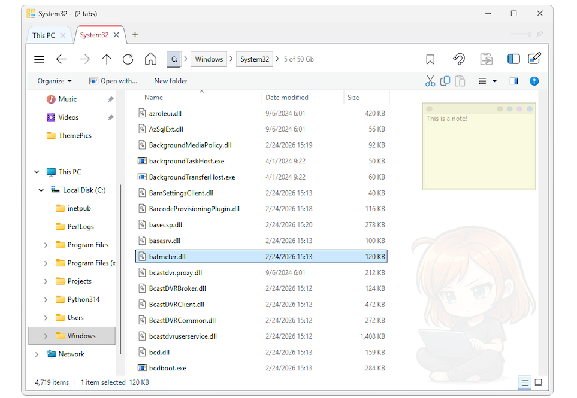

# TabExplorer
A fast, lightweight and portable (simply extract the 7z archive and run the executable) file explorer replacement built on top of the native Windows Explorer to keep full compatibility while adding convenient features such as tabs, path breadcrumbs, selectable native dark mode, notes, themes, background pictures and colors, favorites and dual-pane browsing... All settings are stored in a folder of your choice, keeping your workspace up to date so that even after sudden crashes or reboots you can continue exactly where you left off or backup it.  
👉 See the full manual and features list here: 📘[English](docs/TabExplorer.EN%20-%20English.pdf), 📘[Spanish](docs/TabExplorer.ES%20-%20Castellano.pdf), 📘[Catalan](docs/TabExplorer.CAT%20-%20Català.pdf). 
👉 Download the latest version from here: 💾[releases](https://github.com/incom2/TabExplorer/releases) 
👉 See the list of latest changes here: 📘[Changelog](docs/changelog.md) 
👉 Included languages (you can create yours!): 友 English, 友 Spanish, 友 Catalan.

### About Microsoft Defender false positives
😷 In some cases, Microsoft Defender may flag TabExplorer as a threat. It is not, but as a file explorer it necessarily interacts with the file system and Windows Explorer components. To prevent false positives, a sample was submitted to Microsoft for review on April 28, 2026 (submission ID `1e9a531d-5aa4-472d-b803-26e3940de350`).

### **Benefits**
✔ Uses the real Windows Explorer so everything will work as Microsoft intended. 
✔ Lightweight: ~2 Mb of space and uses ~60 Mb of RAM (less than the native explorer). 
✔ Portable: Run it in a folder of your choice, move it to another… no setup is required. 
✔ Reliable: Your workspace is always saved and restored. Forget sudden crashes or reboots! 
✔ Up-to-date: The explorer core will be updated automatically along with Windows itself. 
✔ Modern: Dark mode, customisable tabs, themes and logos, dual-pane browsing, profiles… and more! 
✔ Infinite workflow: Open as many windows as you want, name them, pin them or bring them back later.

### **Your data and you style**
✔ All your settings are stored in a subfolder inside the TabExplorer folder, in convenient text files. 
✔ You can switch at any time between per-user settings or shared settings for all Windows accounts. 
✔ Adding new languages is a matter of just cloning and editing a simple resource text file. 
&nbsp;&nbsp;&nbsp;&nbsp;&nbsp;&nbsp;PS: Please note the native part of the file explorer will always use Windows language.

### **Take control!**
✔ Intercept any new Windows Explorer window and convert them in new tabs without changing 
&nbsp;&nbsp;&nbsp;&nbsp;&nbsp;&nbsp;obscure system settings! Enable or disable this feature instantly at any moment with just one click.

### **Express yourself**
✔ Set a background image or place your logo in a corner. 
✔ Tint everything or apply effects to the image. 
✔ Save your themes and apply them or share them! 
✔ Switch from Light to Dark mode at any time.

### **Selection made easy**
✔ Start selecting files using simple wildcards (`?` / `*`). 
✔ Add new files to it by simply running a new selection! 
✔ Or remove some files from it by running another one. 
✔ And finally... copy, move, delete at your will.

### **Requirements**
✔ Microsoft Windows 10 or later. 
✔ Microsoft .NET Framework 4.8 (included with Windows).

### **Credits**
💙 *TabExplorer uses components from the Windows® API Code Pack for Microsoft® .NET Framework,* 
&nbsp;&nbsp;&nbsp;&nbsp;&nbsp;&nbsp;*originally published by Microsoft as a managed wrapper around various Windows shell features.* 
💙 *This project was inspired by the archived copy of these libraries, kindly preserved by* 
&nbsp;&nbsp;&nbsp;&nbsp;&nbsp;&nbsp;*[timdetering](https://github.com/timdetering) at [github.com/timdetering/Microsoft.Windows_API_Code_Pack](https://github.com/timdetering/Microsoft.Windows_API_Code_Pack).*

### **API Code Pack custom changes**
✒ *Several modifications were made to the original two libraries to fix issues when navigating* 
&nbsp;&nbsp;&nbsp;&nbsp;&nbsp;&nbsp;*to certain special folders available only on Windows 11.* 
✒ *Additional methods were added to allow redrawing the embedded file explorer,* 
&nbsp;&nbsp;&nbsp;&nbsp;&nbsp;&nbsp;*setting focus, and selecting or unselecting files programmatically.* 
✒ *Finally, the libraries were updated and recompiled to target the latest* 
&nbsp;&nbsp;&nbsp;&nbsp;&nbsp;&nbsp;*.NET Framework version (4.8.1), replacing the older framework originally used.*
